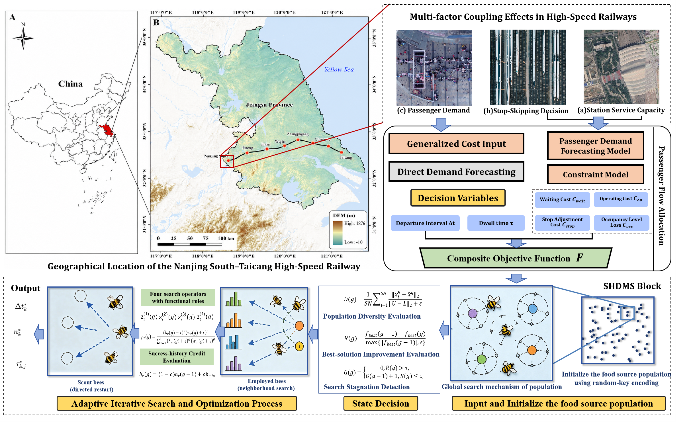
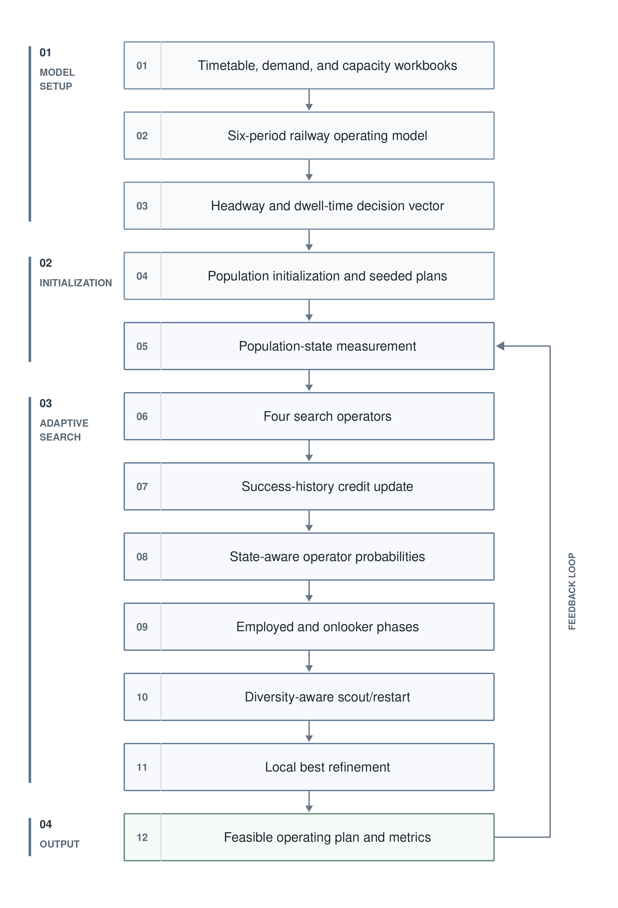
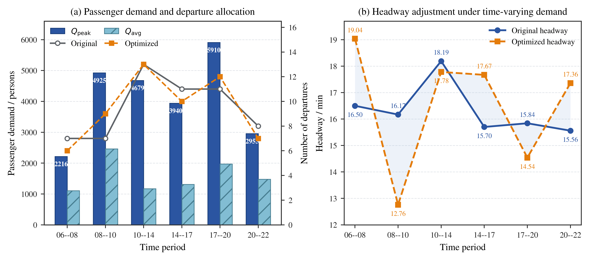
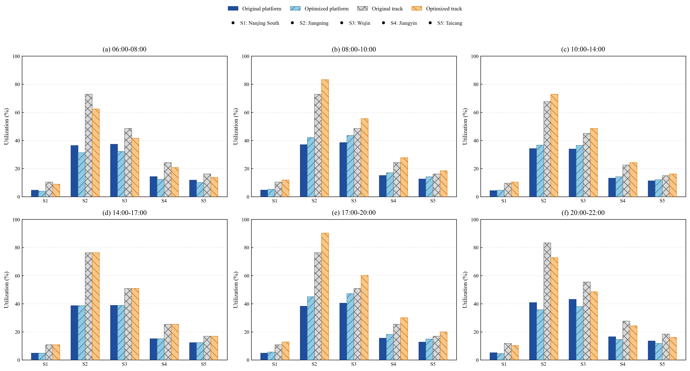
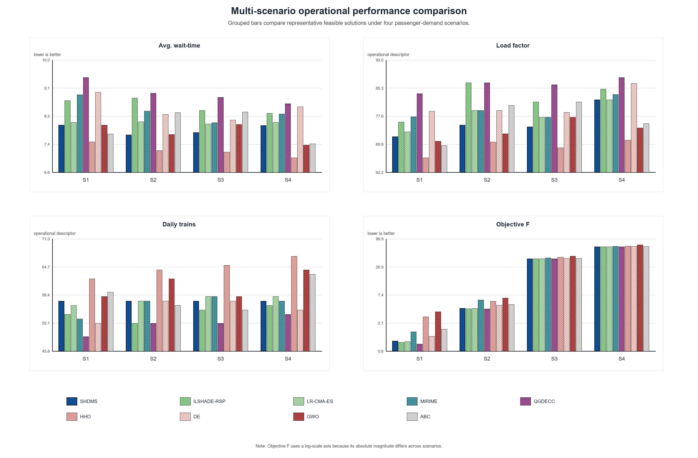
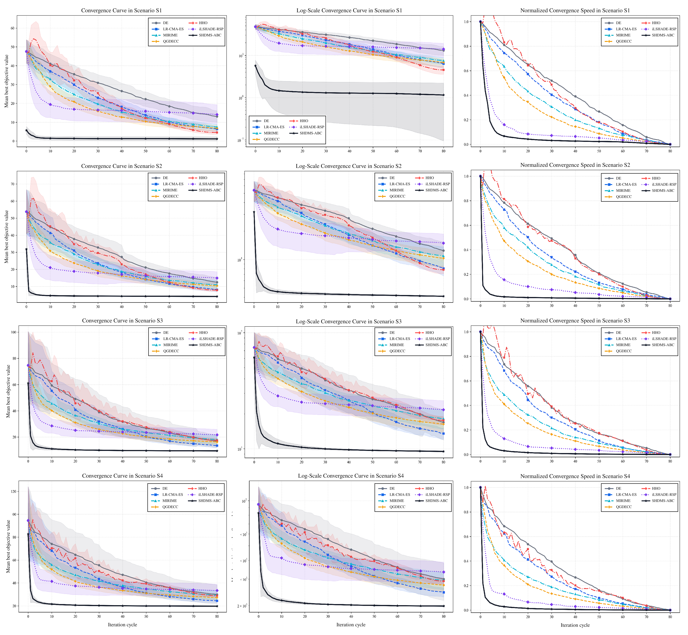
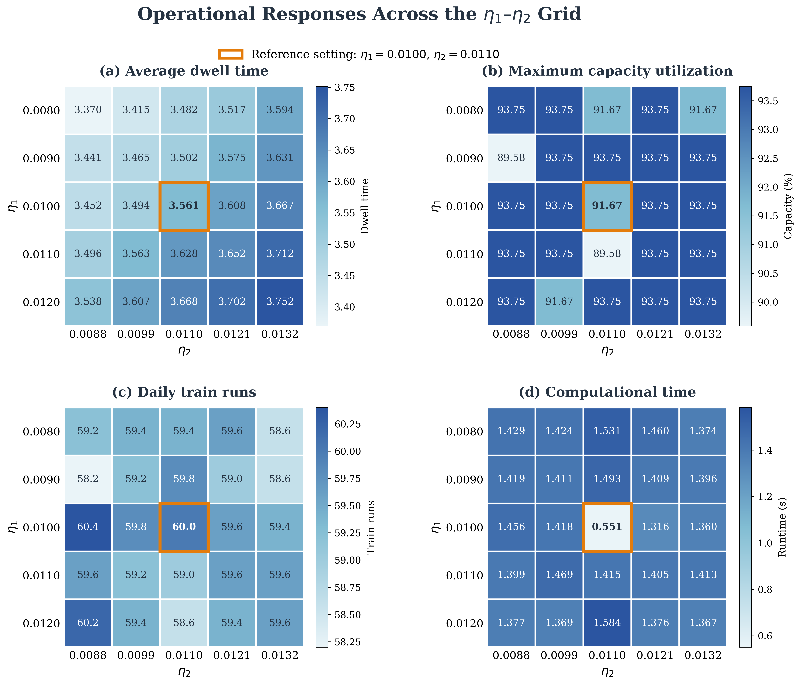

<h1>SHDMS-ABC</h1>

<h3>A dynamic multi-strategy algorithm for train headway optimization in intercity railways</h3>

  <a href="#method-at-a-glance">Method</a> ·
  <a href="#experimental-results">Results</a> ·
  <a href="#experimental-design">Experiments</a> ·
  <a href="#datasets-and-result-workbooks">Data</a> ·
  <a href="#reproduction">Reproduction</a> ·
  <a href="#repository-structure">Structure</a>

  
  
  
  
  
  

SHDMS-ABC is a population-based optimization method for demand-responsive intercity railway timetabling. It optimizes time-period headways and station dwell times while balancing operating cost, passenger waiting cost, load-factor deviation, stop adjustment, and operational constraints.

This repository provides the complete SHDMS-ABC implementation, 18 comparison algorithms, standardized railway datasets, data-preprocessing utilities, 11 experiment entry points, 35 curated result workbooks, and the experimental figures used in the project. Every experiment uses the same dataset loaders, objective definition, constraint treatment, and budget-conversion utilities.

## At a glance

| Item | Configuration |
|---|---|
| Primary task | Multi-objective headway and dwell-time optimization under demand and capacity constraints |
| Main dataset | NST-HSR: Nanjing South–Taicang high-speed railway section |
| Main-case scale | 9 stations; 382 timetable records used between 06:00 and 22:00; 6 operating periods |
| Generalization datasets | New City Express, Wuxiao Intercity, Suishen Intercity, and Beijing Sub-Center |
| Decision variables | Time-period headways and station-period dwell times |
| Objective terms | Operating cost, passenger waiting cost, occupancy deviation, and stop-adjustment cost |
| Main constraints | Platform/line capacity, load factor, revenue, demand coverage, and safe headway |
| Formal budget | Population size 30 and a target of 6,000 objective-function evaluations |
| Evidence package | Operational comparison, algorithm benchmarking, significance tests, sensitivity, ablation, robustness, and cross-line validation |
| Research data | [Dataset description and download information](datasets/DATASET.md) |

## Research question

Demand-responsive railway timetabling requires both global exploration and precise local adjustment. A single search behavior can converge prematurely when the feasible region is narrow, but excessive diversification can waste evaluations and destabilize good operating plans.

SHDMS-ABC tests the following design proposition:

> Search operators should be selected according to both their recent success and the current population state, with diversity-aware restart and local refinement used to maintain progress under a fixed evaluation budget.

The experiments examine this proposition from three perspectives: optimization performance against conventional and recent metaheuristics, the contribution of the four adaptive mechanisms, and transfer across railway lines with different scales and operating patterns.

## Method at a glance

The implementation combines six interacting mechanisms:

1. **Four-operator search portfolio** covering differential exploration, elite-guided search, local exploitation, and long-jump diversification.
2. **Success-history credit learning** that updates operator credit from successful replacements and objective improvements.
3. **Population-state modulation** using diversity, concentration, improvement rate, and stagnation information.
4. **Dynamic operator probabilities** that combine historical credit with the current search state.
5. **Diversity-aware scout and restart control** for stagnant food sources and low-diversity populations.
6. **Seeded initialization and local refinement** using baseline, heuristic, midpoint, and perturbed operating plans.

The implementation is centered in [`algorithm/shdms_abc.py`](algorithm/shdms_abc.py). Common algorithm dispatch is provided by [`algorithm/registry.py`](algorithm/registry.py), and the railway optimization model is defined in [`experiments/common/model.py`](experiments/common/model.py).

## Experimental results

### Demand-responsive operating-plan adjustment

<table>
<tr>
<td width="50%" align="center">

</td>
<td width="50%" align="center">

</td>
</tr>
<tr>
<td valign="top"><strong>Period-level adjustment.</strong> Passenger demand, train departures, and headways are compared before and after optimization over the six operating periods.</td>
<td valign="top"><strong>Capacity utilization.</strong> Platform and line utilization are reported for the key stations in each operating period.</td>
</tr>
</table>

The optimized plan responds to time-varying demand instead of changing every period in the same direction. Peak-period supply can be strengthened while lower-demand periods retain longer headways, subject to the common capacity, load, demand, revenue, and safety constraints.

### Multi-scenario algorithm comparison

<table>
<tr>
<td width="50%" align="center">

</td>
<td width="50%" align="center">

</td>
</tr>
<tr>
<td valign="top"><strong>Operational performance.</strong> Representative feasible plans are compared through waiting time, load factor, daily train count, and the composite objective under scenarios S1–S4.</td>
<td valign="top"><strong>Convergence behavior.</strong> Raw, logarithmic, and normalized convergence views show how the compared algorithms use the common evaluation budget.</td>
</tr>
</table>

The repository retains both optimization-space evidence and operational metrics. Objective values are therefore interpreted together with feasibility, passenger waiting, train supply, load factor, capacity utilization, runtime, and convergence behavior.

### Objective weights and constraint penalties

The composite objective combines four normalized operating terms and five constraint-violation penalties. The baseline objective weights deliberately assign equal priority to railway operating cost and passenger waiting cost, while occupancy deviation and stop adjustment provide secondary regularization.

| Symbol | Model component | Baseline value |
|---|---|---:|
| `ω1` | Railway operating cost, `Cq` | 0.35 |
| `ω2` | Passenger waiting cost, `Cp` | 0.35 |
| `ω3` | Target-occupancy deviation, `Cocc` | 0.15 |
| `ω4` | Dwell/stop-adjustment cost, `Cstop` | 0.15 |

Each weight was perturbed by ±25%, with the other three weights renormalized so that the vector continued to sum to one. Across the eight perturbations, headway MARD remained between 0.71% and 2.05%, the maximum period-level deviation did not exceed 0.79 min, and the change in daily departures stayed between −0.8 and +1.0 trains. Passenger-waiting and operating-cost changes remained within −0.71% to +1.89% and −1.36% to +1.69%, respectively; every tested setting retained 100% feasibility. The largest schedule response occurred for `ω4`, indicating that the stop-adjustment term is the most influential weight within this local test range. See the [objective-weight robustness results](datas/4-9-2.xlsx).

| Symbol | Penalized constraint | Baseline value |
|---|---|---:|
| `λ1` | Platform/line capacity | 2,500 |
| `λ2` | Load-factor bounds | 300 |
| `λ3` | Minimum revenue | 1,200 |
| `λ4` | Demand coverage | 1,800 |
| `λ5` | Safe headway | 5,000 |

Each penalty coefficient was independently scaled by ×0.5 and ×2.0. Headway MARD remained between 0.66% and 1.72%, all ten settings retained 100% feasibility, and runtime changed by −12.91% to +0.87% relative to the baseline. Mean constraint violation remained at or below 0.001775 and the largest observed single violation was 0.00858. These results support local robustness over the tested scaling range, but do not imply invariance to arbitrary penalty values. See the [penalty-coefficient robustness results](datas/4-10-2.xlsx).

### Boarding and alighting dwell-response coefficients

The manuscript notation uses `η1` and `η2`—sometimes visually read as `n1` and `n2`—for the boarding- and alighting-demand contributions to reference dwell time. The supplementary response-surface experiment highlights `η1 = 0.0100` and `η2 = 0.0110` as its reference grid point and evaluates the operational response over a wider neighborhood.

  

Across the plotted grid, average dwell time increases smoothly from 3.370 to 3.752 min as the two coefficients rise. Maximum capacity utilization remains within 89.58%–93.75%, while daily train supply stays in the narrow range of 58.2–60.4 runs. The one-factor ±20% experiment is similarly stable for `η1` in both directions and for a 20% decrease in `η2`: headway MARD remains below 2.70% and all cases are feasible. In contrast, increasing `η2` by 20% raises the composite objective to `3.879683 ± 5.735017`, identifying a local sensitivity to a stronger alighting-time response. See the [coefficient-robustness results](datas/4-8-2.xlsx).

### Supplementary statistical, ablation, and transfer evidence

<table>
<tr>
<td width="50%" align="center"></td>
<td width="50%" align="center"></td>
</tr>
<tr>
<td valign="top"><strong>Scenario-level distributions.</strong> Mean, dispersion, and rank are reported together, making between-run stability visible instead of relying on a single best value.</td>
<td valign="top"><strong>Operational outcomes.</strong> Waiting time, load factor, daily train runs, and the minimum feasible objective connect optimization performance to service decisions.</td>
</tr>
<tr>
<td width="50%" align="center"></td>
<td width="50%" align="center"></td>
</tr>
<tr>
<td valign="top"><strong>Statistical evidence.</strong> Confidence intervals, Friedman ranks, Holm-adjusted tests, and A12 effect sizes distinguish systematic differences from visual gaps.</td>
<td valign="top"><strong>Ablation evidence.</strong> Module removal is evaluated across railway datasets, revealing both stable contributions and line-dependent interactions.</td>
</tr>
<tr>
<td width="50%" align="center"></td>
<td width="50%" align="center"></td>
</tr>
<tr>
<td valign="top"><strong>Generalization and efficiency.</strong> Cross-line ranks are interpreted jointly with runtime to expose the quality–efficiency trade-off.</td>
<td valign="top"><strong>Transfer performance.</strong> Composite objectives and average ranks show that performance transfers across lines but remains dataset dependent.</td>
</tr>
</table>

Taken together, the supplementary results position SHDMS-ABC as a competitive, feasible method rather than a universal winner. It ranks strongly in several scenarios and railway lines, while QGDECC or iLSHADE-RSP remains stronger in others. The ablation results are also mixed across datasets, which supports interpreting the adaptive mechanisms as an interacting system rather than claiming that every module improves every case independently.

## Experimental design

### Operating scenarios

| Scenario | Description |
|---|---|
| `S1` | Baseline demand and capacity setting |
| `S2` | System-wide demand growth |
| `S3` | Peak-period demand intensification |
| `S4` | Key-station stress test with additional demand pressure |

### Unified parameters

| Parameter | Symbol | Setting |
|---|---|---:|
| Independent runs for main comparisons | `N_run` | 10 |
| Independent runs for robustness experiments | `N_run,robustness` | 5 |
| Independent runs for cross-line experiments | `N_run,cross-line` | 50 |
| Population size | `SN` | 30 |
| Target objective evaluations | `NFE_target` | 6,000 |
| Initialization | — | Uniform random initialization with optional seeded operating plans |
| Objective weights | `(ω1, ω2, ω3, ω4)` | `(0.35, 0.35, 0.15, 0.15)` |
| Penalty coefficients | `(λ1, λ2, λ3, λ4, λ5)` | `(2500, 300, 1200, 1800, 5000)` |
| Success-history update rate | `ρH` | 0.30 |
| Historical-credit influence | `α` | 1.35 |
| State-matching influence | `βw` | 1.05 |
| Diversity thresholds | `(τD,low, τD,high)` | `(0.08, 0.22)` |
| Restart threshold | `LR` | 30 |
| Minimum fallback credit | `hmin` | 0.05 |
| Numerical improvement tolerance | `ε` | `1 × 10^-12` |

### Compared algorithms

The repository implements 19 optimizers through a common interface:

- ABC-family methods: ABC, Gbest-ABC, MeABC, MABC, and IABC.
- Differential-evolution methods: DE, JADE, LSHADE, iLSHADE-RSP, and QGDECC.
- Distribution and swarm methods: CMA-ES, LR-CMA-ES, PSO, GWO, HHO, and SMA.
- Recent physics-inspired methods: RIME and MIRIME.
- Proposed method: SHDMS-ABC.

All comparative runs share the same decision bounds, objective function, constraint definitions, random-seed blocks, and target evaluation budget. Algorithm-specific cycle counts are derived from the expected number of evaluations per cycle.

### Experiment entry points

| Entry | Contents |
|---|---|
| [`4-1_period_capacity_change.py`](experiments/4-1_period_capacity_change.py) | Period-level demand, train-frequency, and headway changes |
| [`4-2_operational_economic_comparison.py`](experiments/4-2_operational_economic_comparison.py) | Operational, economic, service-quality, and constraint indicators |
| [`4-3_multiscenario_performance.py`](experiments/4-3_multiscenario_performance.py) | Algorithm performance under S3 and S4 |
| [`4-4_multiscenario_operational_metrics.py`](experiments/4-4_multiscenario_operational_metrics.py) | Feasible operating plans and operational indicators under S1–S4 |
| [`4-5_significance_tests.py`](experiments/4-5_significance_tests.py) | Friedman ranks, paired Wilcoxon tests, Holm correction, and A12 effect size |
| [`4-6_parameter_sensitivity.py`](experiments/4-6_parameter_sensitivity.py) | One-factor sensitivity analysis of SHDMS-ABC parameters |
| [`4-7_ablation_study.py`](experiments/4-7_ablation_study.py) | Operator-weighting, success-history, diversity-control, and restart ablations |
| [`4-8_objective_weight_robustness.py`](experiments/4-8_objective_weight_robustness.py) | Robustness to ±25% objective-weight perturbations |
| [`4-9_penalty_robustness.py`](experiments/4-9_penalty_robustness.py) | Robustness to ×0.5 and ×2.0 penalty changes |
| [`4-10_crossline_operational_effects.py`](experiments/4-10_crossline_operational_effects.py) | Cross-line operational effects and computational efficiency |
| [`4-11_crossline_algorithm_comparison.py`](experiments/4-11_crossline_algorithm_comparison.py) | Cross-line objective values and average algorithm ranks |

See [`experiments/README.md`](experiments/README.md) for the compact experiment-to-code mapping.

## Repository structure

~~~text
SHDMS-ABC/
├── algorithm/                 # SHDMS-ABC and 18 comparison optimizers
├── experiments/
│   ├── common/                # Model, paths, runtime, I/O, robustness, and statistics
│   ├── data_process/          # Four ordered data-validation/export steps
│   ├── 4-1_*.py ... 4-11_*.py
│   └── README.md              # Experiment mapping and unified parameters
├── datasets/
│   ├── NST-HSR/               # Main timetable, demand-factor, and capacity workbooks
│   ├── Supplement/            # Four generalization-oriented railway datasets
│   └── DATASET.md             # Dataset definition and download information
├── datas/                     # 35 curated single-sheet result workbooks
├── images/
│   ├── png/                   # Raster previews for GitHub and the manuscript
│   ├── pdf/                   # Publication-ready vector figures
│   └── supplement/            # Statistical, sensitivity, ablation, and transfer figures
├── requirements.txt
├── .gitignore
└── README.md
~~~

## Datasets and result workbooks

### Railway datasets

Every railway dataset follows the same three-workbook contract:

| Workbook pattern | Granularity | Contents |
|---|---|---|
| `1.*-Timetable.xlsx` | Train-segment level | Timetable, section, interval, distance, fare, and train attributes |
| `2.*-Factors.xlsx` | Station-period level | Boarding/alighting demand and operating factors |
| `3.Platform Capacity.xlsx` | Station level | Platform, line, dwell, buffer, and capacity parameters |

The main NST-HSR data are constructed from publicly available railway information and standardized capacity assumptions. The four supplementary datasets combine public route/station information with simulation-calibrated operational fields. They are intended for controlled generalization experiments and should not be described as complete raw operating data released by railway authorities.

See [`datasets/DATASET.md`](datasets/DATASET.md) for the field-level description and external research-data archive.

### Result workbooks

The [`datas/`](datas) directory contains 35 Excel workbooks organized by manuscript experiment number. Each workbook contains exactly one worksheet (`Sheet1`), uses English headers, contains experimental data only, and excludes environment or configuration metadata. Numbered suffixes such as `4-7-2.xlsx` separate additional result tables belonging to the same experiment group.

### Figures

| Figure | Contents |
|---|---|
| [`png/workflow.png`](images/png/workflow.png) | SHDMS-ABC model setup, initialization, adaptive-search loop, and operating-plan output workflow |
| [`png/4-0.png`](images/png/4-0.png) | Raster overview of the study area, joint optimization model, and SHDMS-ABC workflow |
| [`pdf/Framework.pdf`](images/pdf/Framework.pdf) | Publication-ready vector version of the complete research framework |
| [`png/4-1.png`](images/png/4-1.png) | Expanded passenger-flow, departure-allocation, and headway-response comparison |
| [`png/4.3.1.png`](images/png/4.3.1.png) | Processed manuscript figure for demand-responsive departure and headway adjustment |
| [`pdf/4.3.1.pdf`](images/pdf/4.3.1.pdf) | Vector version of the period-level demand and headway-adjustment figure |
| [`png/4-2.png`](images/png/4-2.png) | Platform and track utilization before and after optimization across six periods |
| [`png/4-3.png`](images/png/4-3.png) | Multi-scenario waiting time, load factor, train supply, and objective comparison |
| [`png/4-4.png`](images/png/4-4.png) | Updated raw, logarithmic, and normalized convergence curves across S1-S4 |
| [`pdf/4.3.2.pdf`](images/pdf/4.3.2.pdf) | Vector multi-scenario convergence comparison with uncertainty bands |
| [`pdf/4.4.4.pdf`](images/pdf/4.4.4.pdf) | Cross-line waiting time, load/capacity utilization, train supply, and operating-cost comparison |
| [`supplement/S1.png`](images/supplement/S1.png) | Scenario-level objective distributions, uncertainty, and algorithm ranks |
| [`supplement/S2.png`](images/supplement/S2.png) | Scenario-level waiting time, load factor, train supply, and minimum objective |
| [`supplement/S3.png`](images/supplement/S3.png) | Confidence intervals, Friedman ranks, Holm tests, and A12 effect sizes |
| [`supplement/S5-2.png`](images/supplement/S5-2.png) | Multi-dataset ablation effects, variability, runtime, and convergence |
| [`supplement/S8.png`](images/supplement/S8.png) | Operational response surfaces across the `η1`–`η2` grid |
| [`supplement/S9-1.png`](images/supplement/S9-1.png) | Cross-line generalization and quality–efficiency comparison |
| [`supplement/S9-2.png`](images/supplement/S9-2.png) | Cross-line composite objectives and average algorithm ranks |

## Installation

The code is CPU-oriented and depends on NumPy, pandas, Matplotlib, and openpyxl.

~~~bash
git clone https://github.com/Lutra11/SHDMS-ABC.git
cd SHDMS-ABC
python -m venv .venv
~~~

<strong>Windows PowerShell installation</strong>

~~~powershell
.\.venv\Scripts\python.exe -m pip install --upgrade pip
.\.venv\Scripts\python.exe -m pip install -r requirements.txt
~~~

<strong>Linux or macOS installation</strong>

~~~bash
source .venv/bin/activate
python -m pip install --upgrade pip
python -m pip install -r requirements.txt
~~~

No GPU is required. Runtime depends on the selected algorithm, number of independent runs, dataset, and objective-evaluation budget.

## Reproduction

Run all commands from the repository root.

### 1. Validate source workbooks

~~~bash
python experiments/data_process/validate_workbooks.py \
  --output outputs/validation_report.csv
~~~

The command checks all five dataset bundles, required workbook fields, station dimensions, demand arrays, and non-negativity constraints.

### 2. Export standardized intermediate data

~~~bash
python experiments/data_process/export_timetables.py --output-dir outputs/processed
python experiments/data_process/export_demand_factors.py --output-dir outputs/processed
python experiments/data_process/export_station_capacity.py --output-dir outputs/processed
~~~

The formal experiment scripts can read the source Excel workbooks directly; the CSV export steps are provided for inspection and interoperability.

### 3. Run a smoke test

~~~bash
python experiments/4-3_multiscenario_performance.py \
  --smoke \
  --output outputs/4-3_smoke.csv
~~~

Smoke mode uses one run, a population of six, and a target of 120 evaluations to verify the complete execution path.

### 4. Run a formal experiment

~~~bash
python experiments/4-3_multiscenario_performance.py \
  --runs 10 \
  --population 30 \
  --target-evaluations 6000 \
  --limit 30 \
  --seed 2026082201 \
  --output outputs/4-3.csv
~~~

The experiment writes an aggregate CSV and, where applicable, a sibling raw-run CSV. Use an explicit `--output` path to keep reproduced files separate from the curated Excel workbooks in [`datas/`](datas).

<strong>Common command-line options</strong>

| Option | Meaning |
|---|---|
| `--runs` | Number of independent runs |
| `--population` | Population size |
| `--target-evaluations` | Target objective-function evaluation budget |
| `--limit` | Stagnation/restart threshold |
| `--seed` | First random seed; subsequent runs use consecutive seeds |
| `--output` | Aggregate CSV output path |
| `--smoke` | Minimal-budget pipeline validation |

## Reproducibility safeguards

- All experiment scripts use the same header-based workbook loaders and centralized railway model.
- Common random-number seeds support paired cross-algorithm statistical tests.
- Algorithms are compared by target objective-evaluation budget rather than nominal iteration count.
- Each manuscript experiment has one independent Python entry point.
- Aggregate and raw-run outputs are separated where statistical analysis requires run-level observations.
- Dataset validation is an explicit preprocessing step and exits with a non-zero status when a bundle fails.
- The `--smoke` option validates the execution chain without altering the formal protocol.
- Robustness experiments change one objective weight or penalty family at a time.
- Supplementary datasets retain the same three-workbook schema as the main NST-HSR dataset.

## License

This project is released under the [MIT License](LICENSE).
